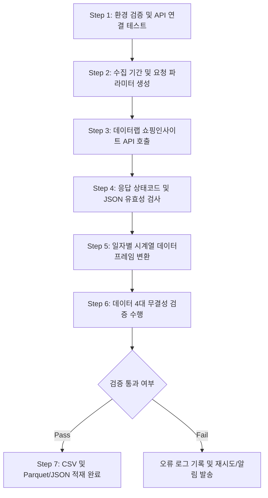

# [작업지시서] 지난 1년간 일자별 네이버 쇼핑트렌드 데이터 수집 및 검증 SOP

| 문서 번호 | SOP-DATALAB-001 | 개정 번호 | v1.0 |
| :--- | :--- | :--- | :--- |
| **작성 일자** | 2026-09-09 | **작업 주기** | 수시 / 정기 배치 (주간·월간) |
| **적용 범위** | 뷰티트렌드 데이터 파이프라인 | **관련 문서** | [01_개발가이드](./01_개발가이드_오픈API_종류_및_비로그인_API.md), [03_쇼핑인사이트_API](./03_데이터랩_쇼핑인사이트_API.md) |

---

## 1. 작업 개요 및 목적

### 1.1 작업 목적
본 작업지시서는 **네이버 데이터랩 쇼핑인사이트 API(`POST /v1/datalab/shopping/categories`)**를 활용하여, **최근 1개년(365일) 일자별(Daily) 쇼핑 검색 클릭 트렌드 데이터**를 누락 없이 안전하게 수집하고, 데이터 무결성 및 정합성을 검증하여 분석용 데이터셋으로 적재하는 표준 절차를 정의합니다.

### 1.2 수집 대상 정의
- **API 서비스**: 네이버 데이터랩 쇼핑인사이트 오픈 API (비로그인 방식)
- **엔드포인트**: `https://openapi.naver.com/v1/datalab/shopping/categories`
- **조회 기준 카테고리**:
  - 대분류: **화장품/미용** (카테고리 코드: `50000002`)
  - (선택/확장) 중분류: 스킨케어, 베이스메이크업 등 세부 분야 코드
- **수집 기간 단위(`timeUnit`)**: `date` (일간 단위)
- **수집 기간(`startDate` ~ `endDate`)**: 실행일 기준 전일(D-1)부터 과거 365일 (최근 1개년)
- **산출물**: 
  - 원본 JSON: `data/raw/shopping_trend_daily_YYYYMMDD.json`
  - 정제 CSV: `data/processed/shopping_trend_daily_YYYYMMDD.csv`
  - 검증 보고서: `reports/validation_report_YYYYMMDD.md`

---

## 2. 사전 준비 사항 및 환경 구성

### 2.1 네이버 개발자 센터 권한 확인
1. [네이버 개발자 센터](https://developers.naver.com/) 로그인 후 **Application > 내 애플리케이션** 접속
2. 프로젝트에 사용될 애플리케이션의 **API 설정** 탭 확인:
   - **사용 API** 목록에 **`데이터랩 (쇼핑인사이트)`**가 체크되어 있는지 필수 확인 (미설정 시 `403 Forbidden` 오류 발생)
3. **개요** 탭에서 `Client ID` 및 `Client Secret` 값을 확인

### 2.2 보안 환경 변수(`.env`) 구성
프로젝트 루트 디렉터리에 `.env` 파일을 생성하고 키를 안전하게 보관합니다. (Git 등 저장소 절대 커밋 금지)
```env
NAVER_CLIENT_ID=your_client_id_here
NAVER_CLIENT_SECRET=your_client_secret_here
```

### 2.3 실행 환경 및 필수 라이브러리
Python 3.9 이상의 환경에서 아래 패키지를 설치합니다.
```bash
pip install requests pandas python-dotenv matplotlib
```

---

## 3. 세부 작업 절차 (Step-by-Step)



### Step 1: 환경 검증 및 연결 테스트
- 발급받은 Client ID와 Client Secret을 HTTP 요청 헤더에 설정하여 단건 호출 테스트를 수행합니다.
- HTTP 헤더 규격:
  ```http
  X-Naver-Client-Id: {NAVER_CLIENT_ID}
  X-Naver-Client-Secret: {NAVER_CLIENT_SECRET}
  Content-Type: application/json
  ```

### Step 2: 수집 기간 산출 (최근 1년 일자 자동 계산)
- 네이버 데이터랩 데이터는 통상 **D-1(전일)** 데이터까지 집계되어 제공됩니다.
- 기준 종료일(`endDate`): 실행일 기준 전일 (`today - 1 day`)
- 기준 시작일(`startDate`): 종료일 기준 365일 전 (`endDate - 364 days`)
- 날짜 표기 형식: `YYYY-MM-DD` (반드시 두 자리 월/일 준수)

### Step 3: 요청 Payload 구성 및 API 호출
- **요청 Body (JSON)**:
  ```json
  {
    "startDate": "2025-09-08",
    "endDate": "2026-09-08",
    "timeUnit": "date",
    "category": [
      {
        "name": "화장품/미용",
        "param": ["50000002"]
      }
    ],
    "device": "",
    "gender": "",
    "ages": []
  }
  ```
  > [!NOTE]
  > `device`, `gender`, `ages`는 빈 문자열 및 빈 배열 설정 시 "전체(All)" 조건으로 조회됩니다. 기기별/성별 분석이 필요한 경우 파라미터를 분할 호출합니다.

### Step 4: 원본 응답 저장 (Raw Data Backup)
- API 호출 성공 시 수신된 순수 JSON 데이터를 즉시 파일로 저장하여 원본을 보존합니다.
- 저장 경로: `data/raw/shopping_trend_50000002_daily_{시작일}_{종료일}.json`

### Step 5: 데이터 정제 및 테이블 변환
- JSON 응답의 `results[0].data` 배열을 평탄화(Flatten)하여 구조화된 테이블로 변환합니다.
- 데이터 스키마:
  | 컬럼명 | 타입 | 설명 | 예시 |
  | :--- | :--- | :--- | :--- |
  | `period` | String (Date) | 수집 대상 일자 (`YYYY-MM-DD`) | `2025-09-08` |
  | `category_id` | String | 쇼핑 분야 코드 | `50000002` |
  | `category_name` | String | 쇼핑 분야 명칭 | `화장품/미용` |
  | `ratio` | Float | 상대적 클릭 지수 (최대 100.0 기준) | `68.4521` |

---

## 4. 데이터 정합성 검증 절차 (QA & Validation)

데이터 수집 직후 아래 **4대 무결성 검증**을 자동 수행하고 검증 리포트를 생성해야 합니다.

### [검증 항목 1] 일자 누락 검증 (Continuous Date Integrity)
- **검증 목적**: 1년간 365일(또는 윤년 366일) 일자가 하루도 누락되지 않았는지 점검
- **검증 기준**: 
  - `수집된 레코드 행 수 == (종료일 - 시작일 + 1)`
  - 누락 일자 집합(`Missing Dates`)이 0건이어야 함.

### [검증 항목 2] 트렌드 지수(`ratio`) 유효 범위 및 피크값 검증
- **검증 기준**:
  - `0.0 <= ratio <= 100.0` 범위를 만족하는가?
  - 조회 기간 내 최댓값(`max(ratio)`)이 정확히 **100.0**인가? (네이버 데이터랩 산출 원리상 필수)
  - 음수 값이나 결측값(`Null`, `NaN`)이 0건인가?

### [검증 항목 3] 데이터 중복 검증
- **검증 기준**: `period` 컬럼 기준 중복된 일자가 존재하지 않아야 함 (`is_unique == True`).

### [검증 항목 4] UI 대조 표본 검증 (선택)
- [네이버 데이터랩 쇼핑인사이트 웹 페이지](https://datalab.naver.com/shoppingInsight/sCategory.naver)에서 동일 조건(화장품/미용, 일간, 1년)을 조회한 후, 특정 피크일(100.0을 기록한 날짜)이 API 수집 결과와 일치하는지 교차 확인.

---

## 5. 표준 실행 스크립트 (`collect_shopping_trend.py`)

작업자는 아래 스크립트를 사용하여 수집 및 검증을 한 번에 실행합니다.

```python
import os
import json
import requests
import pandas as pd
from datetime import datetime, timedelta
from dotenv import load_dotenv

# 1. 환경 변수 로드
load_dotenv()
CLIENT_ID = os.getenv("NAVER_CLIENT_ID")
CLIENT_SECRET = os.getenv("NAVER_CLIENT_SECRET")

if not CLIENT_ID or not CLIENT_SECRET:
    raise ValueError("NAVER_CLIENT_ID 또는 NAVER_CLIENT_SECRET 환경변수가 설정되지 않았습니다.")

# 2. 파라미터 설정 (최근 1년 일자 계산)
CATEGORY_NAME = "화장품/미용"
CATEGORY_ID = "50000002"

end_dt = datetime.now() - timedelta(days=1)  # 전일(D-1) 기준
start_dt = end_dt - timedelta(days=364)      # 365일치 (최근 1개년)

START_DATE = start_dt.strftime("%Y-%m-%d")
END_DATE = end_dt.strftime("%Y-%m-%d")

API_URL = "https://openapi.naver.com/v1/datalab/shopping/categories"
HEADERS = {
    "X-Naver-Client-Id": CLIENT_ID,
    "X-Naver-Client-Secret": CLIENT_SECRET,
    "Content-Type": "application/json"
}

PAYLOAD = {
    "startDate": START_DATE,
    "endDate": END_DATE,
    "timeUnit": "date",
    "category": [
        {"name": CATEGORY_NAME, "param": [CATEGORY_ID]}
    ],
    "device": "",
    "gender": "",
    "ages": []
}

def run_pipeline():
    print(f"[{datetime.now()}] 쇼핑트렌드 수집 시작: {CATEGORY_NAME}({CATEGORY_ID}) [{START_DATE} ~ {END_DATE}]")
    
    # 3. 디렉터리 생성
    os.makedirs("data/raw", exist_ok=True)
    os.makedirs("data/processed", exist_ok=True)
    os.makedirs("reports", exist_ok=True)
    
    # 4. API 요청
    response = requests.post(API_URL, headers=HEADERS, json=PAYLOAD, timeout=15)
    
    if response.status_code != 200:
        print(f"[ERROR] API 호출 실패: HTTP {response.status_code}")
        print(response.text)
        return False
        
    res_json = response.json()
    
    # 5. Raw Data 저장
    raw_path = f"data/raw/shopping_trend_{CATEGORY_ID}_daily_{START_DATE}_{END_DATE}.json"
    with open(raw_path, "w", encoding="utf-8") as f:
        json.dump(res_json, f, ensure_ascii=False, indent=2)
    print(f"[OK] Raw Data 저장 완료: {raw_path}")
    
    # 6. 정제 및 DataFrame 변환
    data_list = res_json["results"][0]["data"]
    df = pd.DataFrame(data_list)
    df["category_id"] = CATEGORY_ID
    df["category_name"] = CATEGORY_NAME
    df["period"] = pd.to_datetime(df["period"])
    df = df.sort_values("period").reset_index(drop=True)
    
    # 7. 무결성 검증 (Validation)
    print("\n--- [데이터 정합성 검증 시작] ---")
    
    # 검증 1: 기대 날짜 생성 및 누락 점검
    expected_dates = pd.date_range(start=START_DATE, end=END_DATE, freq="D")
    expected_count = len(expected_dates)
    actual_count = len(df)
    
    missing_dates = expected_dates.difference(df["period"])
    has_missing = len(missing_dates) > 0
    
    # 검증 2: Ratio 유효성 및 Max 100 점검
    max_ratio = df["ratio"].max()
    min_ratio = df["ratio"].min()
    has_null = df["ratio"].isnull().any()
    is_max_100 = (max_ratio == 100.0)
    
    # 검증 3: 중복 일자 점검
    is_unique_dates = df["period"].is_unique
    
    print(f"1. 수집 건수 / 기대 건수: {actual_count} / {expected_count}")
    print(f"2. 누락 일자 수: {len(missing_dates)}일")
    print(f"3. 최솟값 / 최댓값: {min_ratio:.4f} / {max_ratio:.4f} (Max 100 일치 여부: {is_max_100})")
    print(f"4. Null 값 존재 여부: {has_null}")
    print(f"5. 일자 고유성(중복 없음): {is_unique_dates}")
    
    validation_passed = (
        (actual_count == expected_count) and 
        (not has_missing) and 
        is_max_100 and 
        (not has_null) and 
        is_unique_dates
    )
    
    # 8. 검증 결과 저장
    processed_path = f"data/processed/shopping_trend_{CATEGORY_ID}_daily_{START_DATE}_{END_DATE}.csv"
    df.to_csv(processed_path, index=False, encoding="utf-8-sig")
    print(f"[OK] 정제 데이터 저장 완료: {processed_path}")
    
    report_path = f"reports/validation_report_{CATEGORY_ID}_{END_DATE}.md"
    with open(report_path, "w", encoding="utf-8") as f:
        f.write(f"# 쇼핑트렌드 데이터 수집 검증 보고서\n\n")
        f.write(f"- **대상 분야**: {CATEGORY_NAME} (`{CATEGORY_ID}`)\n")
        f.write(f"- **조회 기간**: {START_DATE} ~ {END_DATE} (총 {expected_count}일)\n")
        f.write(f"- **수집 일시**: {datetime.now().strftime('%Y-%m-%d %H:%M:%S')}\n")
        f.write(f"- **검증 결과**: {'✅ PASS (합격)' if validation_passed else '❌ FAIL (불합격)'}\n\n")
        f.write(f"## 세부 점검 결과\n")
        f.write(f"| 점검 항목 | 기준값 | 실제 측정값 | 결과 |\n")
        f.write(f"| :--- | :---: | :---: | :---: |\n")
        f.write(f"| 일자 연속성(행 수) | {expected_count}일 | {actual_count}일 | {'PASS' if actual_count == expected_count else 'FAIL'} |\n")
        f.write(f"| 누락 일자 건수 | 0일 | {len(missing_dates)}일 | {'PASS' if not has_missing else 'FAIL'} |\n")
        f.write(f"| 피크 트렌드 지수 | 100.0 | {max_ratio} | {'PASS' if is_max_100 else 'FAIL'} |\n")
        f.write(f"| 결측치(NaN/Null) | 0건 | {df['ratio'].isnull().sum()}건 | {'PASS' if not has_null else 'FAIL'} |\n")
        f.write(f"| 일자 중복 여부 | 없음 | {'없음' if is_unique_dates else '중복발견'} | {'PASS' if is_unique_dates else 'FAIL'} |\n\n")
        
        peak_row = df.loc[df["ratio"] == max_ratio].iloc[0]
        f.write(f"## 주요 트렌드 요약\n")
        f.write(f"- **최고 클릭 피크일**: `{peak_row['period'].strftime('%Y-%m-%d')}` (Ratio: 100.0)\n")
        f.write(f"- **최저 클릭일**: `{df.loc[df['ratio'] == min_ratio].iloc[0]['period'].strftime('%Y-%m-%d')}` (Ratio: {min_ratio:.4f})\n")
        f.write(f"- **평균 일간 트렌드 지수**: `{df['ratio'].mean():.2f}`\n")
        
    print(f"[OK] 검증 리포트 발행: {report_path}")
    print(f"\n최종 상태: {'SUCCESS (정상 완료)' if validation_passed else 'WARNING (확인 필요)'}")
    return validation_passed

if __name__ == "__main__":
    run_pipeline()
```

---

## 6. 장애 대응 및 예외 처리 매뉴얼 (Troubleshooting)

| HTTP 코드 | 원인 (Cause) | 조치 방법 (Action Item) |
| :---: | :--- | :--- |
| **`400 Bad Request`** | • `startDate`가 `2017-08-01` 이전이거나 날짜 형식 오류<br>• `timeUnit` 철자 오류 (`date`, `week`, `month` 외 값 입력)<br>• 존재하지 않는 카테고리 코드 | • 요청 JSON 파라미터 날짜 형식(`YYYY-MM-DD`) 확인<br>• 카테고리 코드(`50000002` 등) 재검증 |
| **`401 / 403`** | • Client ID / Secret 오기입<br>• 네이버 개발자 센터에서 **데이터랩 (쇼핑인사이트)** API 사용 권한 미설정 | • `.env` 파일의 API Key 값 일치 여부 확인<br>• 개발자 센터 **애플리케이션 > API 설정**에서 권한 추가 |
| **`429 Quota Exceeded`** | • 하루 호출 한도(쇼핑인사이트 1,000회/일) 초과 | • 24시(자정) 초기화 대기 또는 별도 애플리케이션 키로 분산 |
| **`500 Server Error`** | • 네이버 데이터랩 일시적 서버 장애 | • Exponential Backoff (3초, 5초, 10초) 적용 후 최대 3회 재시도 |

---

## 7. 작업 완료 체크리스트 (Checklist)

작업 담당자는 작업 완료 후 아래 항목을 체크하고 서명합니다.

- [ ] `.env`에 등록된 Client ID/Secret을 통해 정상 인증되는지 확인하였는가?
- [ ] 최근 365일(`startDate` ~ `endDate`)의 데이터가 빠짐없이 수집되었는가?
- [ ] 수집된 일자 중 중간 누락(Missing Date)이 0건임을 확인하였는가?
- [ ] 구간 내 최대 트렌드 비율(`ratio`)이 정확히 100.0인지 확인하였는가?
- [ ] Raw JSON 및 정제 CSV 파일이 지정된 디렉터리에 정상 저장되었는가?
- [ ] `reports/` 폴더에 검증 리포트(`validation_report_*.md`)가 정상 생성되었는가?
